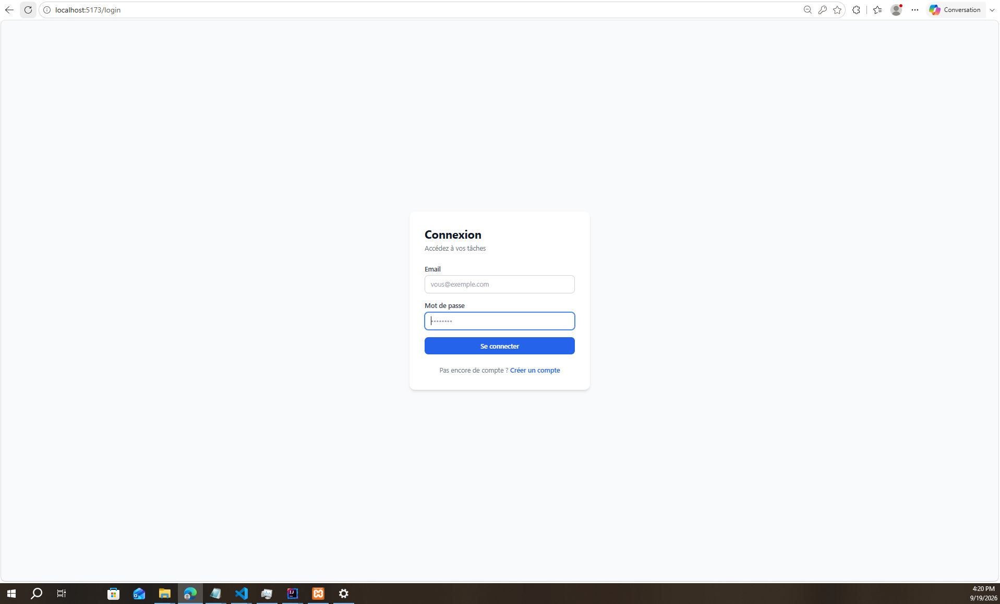
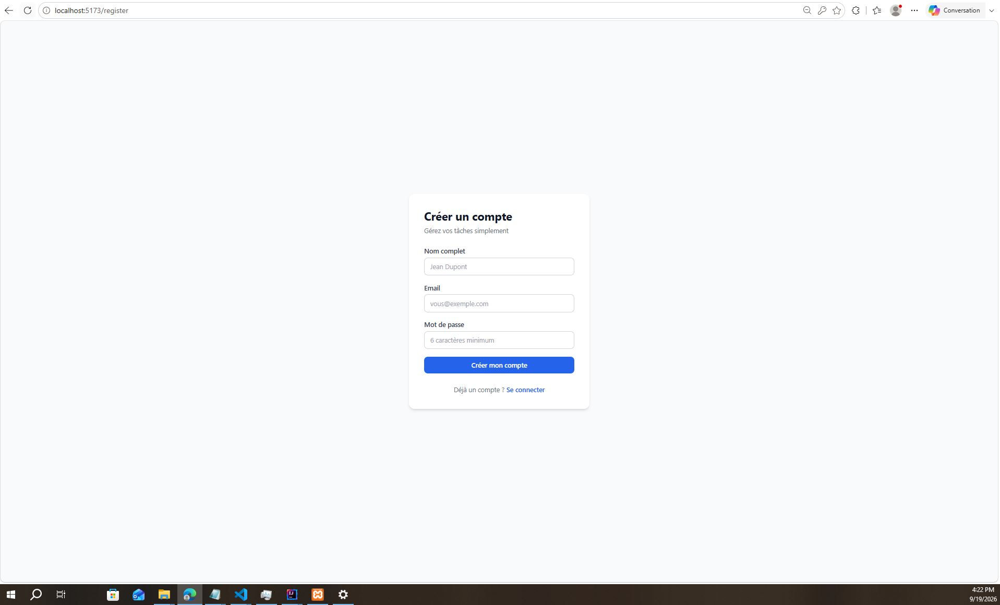
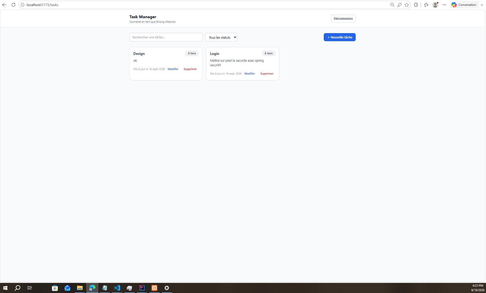
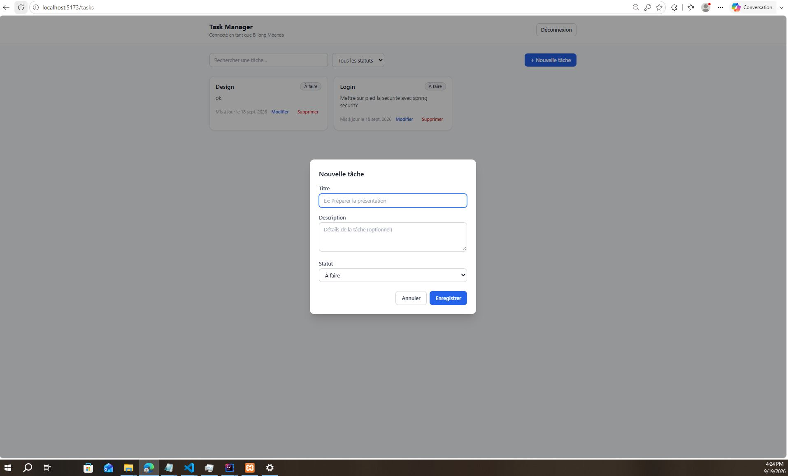

# Task Manager — Application complète (Web + Mobile)

Petite-application de gestion de tâches réalisée dans le cadre du test de recrutement a COVA, intégrant :

- un **backend** REST en **Java Spring Boot** (JWT, MySQL, JPA)
- un **frontend web** en **React + Vite + TypeScript (TSX)** avec Tailwind CSS
- une **application mobile** en **Flutter** consommant la même API que le client developper en React
- un pipeline **CI/CD** GitHub Actions + déploiement **Docker / Google Cloud Platform**

---

# Architecture

```
taskmanager/
├── backend/          # API Spring Boot (Java 17, Spring Security, JPA, MySQL)
├── frontend/         # Application web React + Vite + TSX + Tailwind
├── mobile/           # Application mobile Flutter
├── .github/workflows/ci-cd.yml   # Pipeline CI/CD
├── docker-compose.yml            # Orchestration locale (MySQL + backend + frontend)
└── README.md
```

**Choix techniques principaux :**

| Aspect | Choix | Justification |
|---|---|---|
| Authentification | JWT stateless (Spring Security) | Pas de session serveur, scalable, compatible web + mobile |
| Mot de passe | BCrypt | Standard de hachage sécurisé recommandé par Spring Security |
| Persistance | Spring Data JPA + MySQL (H2 en tests) | CRUD simple, ORM productif, H2 permet des tests sans dépendance externe |
| Frontend | React 18 + Vite + TypeScript | Typage fort, build rapide, DX moderne |
| Style | Tailwind CSS | Développement rapide d'une UI cohérente sans CSS custom lourd |
| État d'authentification | Context API + localStorage | Simplicité adaptée à la taille du projet|
| Mobile | Flutter + `http` + `shared_preferences` | Un seul codebase iOS/Android, consomme directement l'API JWT existante |
| Conteneurisation | Docker multi-stage | Images légères en production (JRE alpine / nginx alpine) |
| CI/CD | GitHub Actions → Cloud Run | Pipeline simple, déploiement serverless sans gestion d'infra |

---

## Démarrage rapide (local, sans Docker)

### 1. Backend (Spring Boot)

Prérequis : **Java 17**, **Maven**, **MySQL** (ou utiliser H2 pour tester sans base de donnée).

```bash
cd backend

# Option A — avec MySQL local
# Créez d'abord une base de donnée "taskmanager" dans votre MySQL, puis :
export SPRING_PROFILES_ACTIVE=mysql
export DB_USER=root
export DB_PASSWORD=votre_mot_de_passe
mvn spring-boot:run

# Option B — sans base externe (H2 en mémoire, pratique pour tester rapidement)
export SPRING_PROFILES_ACTIVE=h2
mvn spring-boot:run
```

L'API démarre sur **http://localhost:8080**.

### 2. Frontend (React + Vite)

Prérequis : **Node.js 20+**.

```bash
cd frontend
cp .env.task .env   # VITE_API_URL=http://localhost:8080/api
npm install
npm run dev
```

L'application est disponible sur **http://localhost:5173**.

### 3. Mobile (Flutter) — bonus

Prérequis : **Flutter SDK** installé.

```bash
cd mobile
flutter pub get
flutter run
```

Sur émulateur Android, l'URL `http://10.0.2.2:8080/api` (déjà configurée dans `lib/services/api_service.dart`) pointe vers le `localhost` de votre machine. Sur un appareil physique, remplacez cette URL par l'IP de votre machine ou l'URL publique déployée.

---

## Démarrage avec Docker tout-en-un

Prérequis : **Docker** et **Docker Compose**.

```bash
docker compose up --build
```

Cela lance automatiquement :
- **MySQL** sur le port `3306`
- **Backend Spring Boot** sur `http://localhost:8080`
- **Frontend React** (servi par nginx) sur `http://localhost:80`

---

## Endpoints de l'API

| Méthode | Endpoint | Description | Auth requise |
|---------|----------|-------------|--------------|
| POST    | `/api/auth/register` | Inscription d'un utilisateur | Non |
| POST    | `/api/auth/login`    | Connexion (retourne un JWT)   | Non |
| GET     | `/api/tasks?status=&search=` | Liste des tâches de l'utilisateur connecté (filtrage optionnel) | Oui |
| POST    | `/api/tasks`         | Créer une tâche              | Oui |
| PUT     | `/api/tasks/{id}`    | Modifier une tâche           | Oui |
| DELETE  | `/api/tasks/{id}`    | Supprimer une tâche          | Oui |


Toutes les routes protégées attendent l'en-tête contenant : Authorization: Bearer <votre_token_jwt>

**Exemple d'inscription :**
```bash
curl -X POST http://localhost:8080/api/auth/register \
  -H "Content-Type: application/json" \
  -d '{"fullName":"Billong Donald","email":"billongdonald9@gmail.com","password":"secret123"}'
```

**Exemple de création de tâche :**
```bash
curl -X POST http://localhost:8080/api/tasks \
  -H "Content-Type: application/json" \
  -H "Authorization: Bearer VOTRE_TOKEN" \
  -d '{"title":"Préparer la démo","description":"Finaliser les slides","status":"TODO"}'
```

---

## Fonctionnalités implémentées

**Backend**
- [x] Inscription / connexion avec JWT
- [x] CRUD complet des tâches (Create, Read, Update, Delete)
- [x] Chaque tâche est liée à son propriétaire (isolation des données par utilisateur)
- [x] Filtrage par statut et recherche par titre
- [x] Validation des entrées (Bean Validation)
- [x] Gestion centralisée des erreurs (`@RestControllerAdvice`)
- [x] Mots de passe hachés avec BCrypt
- [x] Configuration CORS pour le frontend

**Frontend Web**
- [x] Formulaires d'inscription et de connexion
- [x] Liste des tâches en temps réel
- [x] Ajout, édition, suppression de tâches (modale)
- [x] Filtrage par statut + recherche texte
- [x] Gestion des erreurs API via notifications toast
- [x] Stockage du token JWT dans `localStorage`
- [x] Redirection automatique si token invalide/expiré (401)
- [x] Routes protégées (`ProtectedRoute`)

**Mobile Flutter**
- [x] Connexion / inscription via la même API JWT
- [x] Liste des tâches avec `ListView`
- [x] Création / édition via formulaire modal (`TextField`, `ElevatedButton`)
- [x] Suppression avec confirmation
- [x] Filtrage par statut et recherche
- [x] Persistance du token via `shared_preferences`

**DevOps**
- [x] `Dockerfile` multi-stage pour le backend (Maven → JRE alpine)
- [x] `Dockerfile` multi-stage pour le frontend (Node → nginx alpine)
- [x] `docker-compose.yml` orchestrant MySQL + backend + frontend
- [x] Pipeline GitHub Actions (`.github/workflows/ci-cd.yml`) : build + tests backend/frontend, puis build d'images Docker et déploiement sur **Google Cloud Run**

---

## Captures d'écran

**CAPTURE LOGIN :**


**CAPTURE CREATION UTILISATEUR :**


**CAPTURE LISTE TACHE :**


**CAPTURE CREATION TACHE :**



---

## Variables d'environnement

**Backend** (`application.properties` / variables d'environnement)

| Variable | Défaut | Description |
|---|---|---|
| `SPRING_PROFILES_ACTIVE` | `mysql` | `mysql` ou `h2` |
| `DB_HOST` / `DB_PORT` / `DB_NAME` / `DB_USER` / `DB_PASSWORD` | `localhost`/`3306`/`taskmanager`/`root`/`root` | Connexion MySQL |
| `JWT_SECRET` | (valeur par défaut, **à changer en production**) | Clé de signature des tokens |
| `JWT_EXPIRATION_MS` | `86400000` (24h) | Durée de validité du token |
| `CORS_ALLOWED_ORIGINS` | `http://localhost:5173` | Origines autorisées |

**Frontend** (`.env`)

| Variable | Exemple |
|---|---|
| `VITE_API_URL` | `http://localhost:8080/api` |

---

## Déploiement GCP (bonus)

Le pipeline `.github/workflows/ci-cd.yml` déploie automatiquement sur **Cloud Run** à chaque push sur `main`, après succès des tests. Il nécessite les secrets GitHub suivants :

- `GCP_PROJECT_ID`, `GCP_SA_KEY` (clé de compte de service JSON)
- `DB_HOST`, `DB_NAME`, `DB_USER`, `DB_PASSWORD`, `JWT_SECRET`
- `BACKEND_PUBLIC_URL` (URL Cloud Run du backend, utilisée pour builder le frontend avec la bonne API)

---

## Rendu du test

- Code source complet dans ce dossier (structure monorepo `backend/`, `frontend/`, `mobile/`)
- README avec instructions d'installation et description technique
- Pipeline CI/CD prêt à l'emploi
